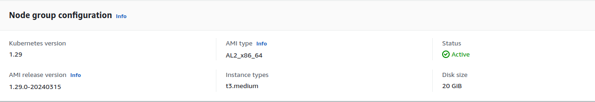
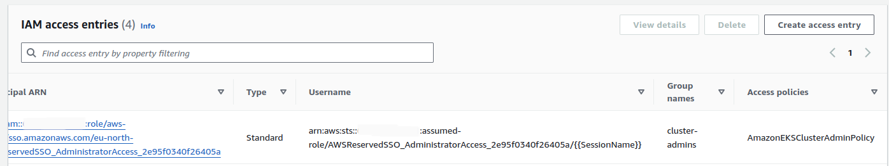

# AWS - Amazon Web Services

This document covers how to link Multi Tenant Operator with an EKS cluster.

## Setting up an EKS Cluster

In this example, we have already set-up a small EKS cluster with the following node group specifications



We have access configuration set as both, EKS API and Configmap, so that admin can access the cluster using EKS API and map IAM users to our EKS cluster using `aws-auth` configmap.


And we have a policy `AmazonEKSClusterAdminPolicy` attached with our user which makes it a cluster admin. To be noted, the user is also added in the `cluster-admins` group which we will later use while installing MTO.



## Installing Cert Manager and MTO

We, as cluster admins, will start by installing cert manager for automated handling of operator certs.

```bash
kubectl apply -f https://github.com/cert-manager/cert-manager/releases/download/v1.14.4/cert-manager.yaml
```

Let's wait for the pods to be up.

```bash
NAME                                       READY   STATUS    RESTARTS   AGE
cert-manager-7fb948f468-wgcbx              1/1     Running   0          7m18s
cert-manager-cainjector-75c5fc965c-wxtkp   1/1     Running   0          7m18s
cert-manager-webhook-757c9d4bb7-wd9g8      1/1     Running   0          7m18s
```

We will be using helm to install the operator, here we have set `bypassedGroups` as `cluster-admins` because our admin user is part of that group as seen in above screenshot.

```terminal
helm install tenant-operator oci://ghcr.io/stakater/charts/multi-tenant-operator --version 0.11.0 --namespace multi-tenant-operator --create-namespace --set bypassedGroups=cluster-admins
```

We will wait for the pods to come in running state.

```bash
NAME                                                              READY   STATUS    RESTARTS   AGE
tenant-operator-namespace-controller-768f9459c4-758kb             2/2     Running   0          2d14h
tenant-operator-pilot-controller-7c96f6589c-d979f                 2/2     Running   0          2d14h
tenant-operator-resourcesupervisor-controller-566f59d57b-xbkws    2/2     Running   0          2d14h
tenant-operator-template-quota-intconfig-controller-7fc99462dz6   2/2     Running   0          2d14h
tenant-operator-templategroupinstance-controller-75cf68c872pljv   2/2     Running   0          2d14h
tenant-operator-templateinstance-controller-d996b6fd-cx2dz        2/2     Running   0          2d14h
tenant-operator-tenant-controller-57fb885c84-7ps92                2/2     Running   0          2d14h
tenant-operator-webhook-5f8f675549-jv9n8                          2/2     Running   0          2d14h
```

## Users Interaction with the Cluster

We will use two types of users to interact with the cluster, IAM users created via AWS Console and SSO Users.

### IAM Users

We have created a user named `test-benzema-mto` in AWS Console, with ARN `arn:aws:iam::<account>:user/test-benzema-mto`.
This user has a policy attached to be able to get cluster info

```json
{
    "Statement": [
        {
            "Action": "eks:DescribeCluster",
            "Effect": "Allow",
            "Resource": "*"
        }
    ],
    "Version": "2012-10-17"
}
```

We have mapped this user in `aws-auth` configmap in `kube-system` namespace.

```yaml
  mapUsers:
    - groups:
      - iam-devteam
      userarn: arn:aws:iam::<account>:user/test-benzema-mto
      username: test-benzema-mto
```

Using this [AWS guide](https://docs.aws.amazon.com/eks/latest/userguide/create-kubeconfig.html), we will ask the user to update its kubeconfig and try to access the cluster.

Since we haven't attached any RBAC with this user at the moment, trying to access anything in the cluster would throw an error

```terminal
$ kubectl get svc

Error from server (Forbidden): services is forbidden: User "test-benzema-mto" cannot list resource "services" in API group "" in the namespace "default"
```

### SSO Users

For SSO Users, we will map a role `arn:aws:iam::<account>:role/aws-reserved/sso.amazonaws.com/eu-north-1/AWSReservedSSO_PowerUserAccess_b0ad9936c75e5bcc`, that is attached by default with Users on SSO login to the AWS console and `awscli`, in `aws-auth` configmap in `kube-system` namespace.

```yaml
  mapRoles:
    - groups:
      - sso-devteam
      rolearn: arn:aws:iam::<account>:role/AWSReservedSSO_PowerUserAccess_b0ad9936c75e5bcc
      username: sso-devteam:{{SessionName}}
```

Since this user also doesn't have attached RBAC, trying to access anything in the cluster would throw an error

```terminal
$ kubectl get svc

Error from server (Forbidden): services is forbidden: User "sso-devteam:random-user-stakater.com" cannot list resource "services" in API group "" in the namespace "default"
```

### Setting up Tenant for Users

Now, we will set tenants for the above-mentioned users.

We will start by creating a `Quota CR` with some resource limits

```yaml
kubectl apply -f - <<EOF
apiVersion: tenantoperator.stakater.com/v1beta1
kind: Quota
metadata:
  name: small
spec:
  limitrange:
    limits:
    - max:
        cpu: 800m
      min:
        cpu: 200m
      type: Container
  resourcequota:
    hard:
      configmaps: "10"
      memory: "8Gi"
EOF
```

Now, we will mention this `Quota` in two `Tenant` CRs

```yaml
kubectl apply -f - <<EOF
apiVersion: tenantoperator.stakater.com/v1beta2
kind: Tenant
metadata:
  name: tenant-iam
spec:
  namespaces:
    withTenantPrefix:
    - dev
    - build
  owners:
    groups:
    - iam-devteam
  quota: small
EOF
```

```yaml
kubectl apply -f - <<EOF
apiVersion: tenantoperator.stakater.com/v1beta2
kind: Tenant
metadata:
  name: tenant-sso
spec:
  namespaces:
    withTenantPrefix:
    - dev
    - build
  owners:
    groups:
    - sso-devteam
  quota: small
EOF
```

Notice that the only difference in both tenant specs are the groups.

### Accessing Tenant Namespaces

After the creation of `Tenant` CRs, now users can access namespaces in their respective tenants and preform create, update, delete functions.

Listing the namespaces by cluster admin will show us the recently created tenant namespaces

```bash
$ kubectl get namespaces

NAME                    STATUS   AGE
cert-manager            Active   8d
default                 Active   9d
kube-node-lease         Active   9d
kube-public             Active   9d
kube-system             Active   9d
multi-tenant-operator   Active   8d
random                  Active   8d
tenant-iam-build        Active   5s
tenant-iam-dev          Active   5s
tenant-sso-build        Active   5s
tenant-sso-dev          Active   5s
```

### IAM Users on Tenant Namespaces

We will now try to deploy a pod from user `test-benzema-mto` in its tenant namespace `tenant-iam-dev`

```bash
$ kubectl run nginx --image nginx -n tenant-iam-dev

pod/nginx created
```

And if we try the same operation in the other tenant with the same user, it will fail

```bash
$ kubectl run nginx --image nginx -n tenant-sso-dev

Error from server (Forbidden): pods is forbidden: User "test-benzema-mto" cannot create resource "pods" in API group "" in the namespace "tenant-sso-dev"
```

To be noted, `test-benzema-mto` can not list namespaces

```bash
$ kubectl get namespaces

Error from server (Forbidden): namespaces is forbidden: User "test-benzema-mto" cannot list resource "namespaces" in API group "" at the cluster scope
```

### SSO Users on Tenant Namespaces

We will repeat the above operations for our SSO user `sso-devteam:random-user-stakater.com` as well

```bash
$ kubectl run nginx --image nginx -n tenant-sso-dev

pod/nginx created
```

Trying to do operations outside the scope of its own tenant will result in errors

```bash
$ kubectl run nginx --image nginx -n tenant-iam-dev

Error from server (Forbidden): pods is forbidden: User "sso-devteam:random-user-stakater.com" cannot create resource "pods" in API group "" in the namespace "tenant-iam-dev"
```

To be noted, `sso-devteam:random-user-stakater.com` can not list namespaces

```bash
$ kubectl get namespaces

Error from server (Forbidden): namespaces is forbidden: User "sso-devteam:random-user-stakater.com" cannot list resource "namespaces" in API group "" at the cluster scope
```
