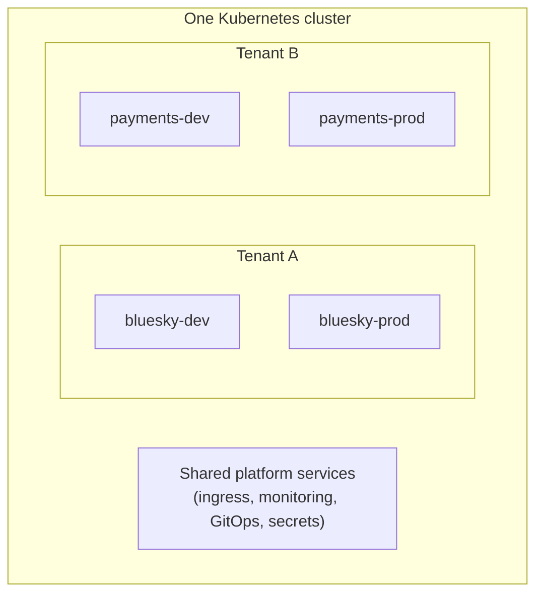
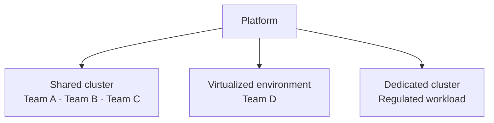

# Deployment Models

There is no single Kubernetes multi-tenancy architecture that suits every workload. Some organizations share one cluster between teams; some need stronger isolation through virtual clusters; some need a dedicated cluster per tenant. Large platforms usually end up with more than one.

These are decisions about **isolation**. MTO is a decision about the **operating model** — who a tenant is, what they own, what they may consume, and what boundaries apply. The two are separate choices, and conflating them is what makes the "namespaces or clusters?" debate go in circles.

This page describes where MTO fits in each architecture.

## Shared clusters

Multiple tenants run on the same cluster, separated by namespace, RBAC, quota, network policy and admission control.

**This is the model MTO is built for.** Everything MTO does — tenant ownership, namespace lifecycle, RBAC, quota at the tenant scope, admission guardrails, network isolation, templates, cost attribution, hibernation, and extension into ArgoCD and OpenBao/Vault — applies directly here.

It suits internal development teams, shared enterprise platforms, development and test environments, and any situation where efficient infrastructure sharing matters.

The limit is honest and worth stating: tenants share one API server and one set of nodes. That is the right trade for teams, departments and customers inside one organization's trust boundary. It is not the right trade for a genuinely hostile tenant.

## Virtual clusters

Virtual-cluster technologies give each tenant a separate Kubernetes control-plane experience — its own API server and its own CRDs — while sharing the underlying compute.

That solves a different problem from the one MTO solves. A virtual cluster is a stronger *isolation* boundary; it does not tell you who owns it, what it may consume, what it costs, or how it is standardized. Those questions come back the moment you have thirty virtual clusters instead of thirty namespaces.

Use a virtual cluster when a tenant needs:

- CRDs or cluster-scoped configuration that would conflict with another tenant's
- Cluster-admin-like autonomy inside its own boundary
- Control-plane separation that namespace isolation cannot provide

Virtual clusters and MTO are not competing answers to one question. They answer different questions, at different layers.

## Dedicated clusters

Some tenants require complete cluster isolation — for regulatory or security reasons, for customer-contractual isolation, or because the workload's scale or lifecycle demands it.

Dedicated clusters give the strongest boundary and the highest operational cost: every cluster is another control plane, monitoring stack, upgrade cycle and on-call surface.

MTO is installed per cluster. Where several clusters each host more than one team, applying the same `Tenant`, `Quota` and `IntegrationConfig` definitions to each of them through GitOps gives every cluster the same tenancy model, reviewed in one place. MTO does not federate across clusters or provide a single fleet-wide view — each installation governs its own cluster.

## Hybrid platforms

Most large platforms arrive here:

The useful question is not *"namespaces or dedicated clusters?"* It is:

> What level of isolation does each workload actually require, and how do we give every tenant a consistent platform experience across those boundaries?

## Choosing the model

| Requirement | Shared cluster | Virtual cluster | Dedicated cluster |
|---|---|---|---|
| Infrastructure efficiency | High | High | Lower |
| Namespace isolation | Yes | Yes | Yes |
| Kubernetes API isolation | Limited | Stronger | Strongest |
| Control-plane autonomy | Low | Higher | Full |
| Infrastructure isolation | Low | Partial | Full |
| Operational overhead | Low | Medium | High |
| Typical cost | Lower | Medium | Higher |

MTO is strongest where the goal is to turn Kubernetes infrastructure into an operational multi-tenant *platform*, rather than only to draw an isolation boundary. Pick the isolation architecture from the workload's requirements; pick the tenant operating model separately.

## Next

- [Why MTO](why-mto.md) — the argument for the operating model
- [How MTO Works](how-it-works.md) — the reconciliation path, end to end
- [Use Cases](use-cases.md) — the situations these models show up in
