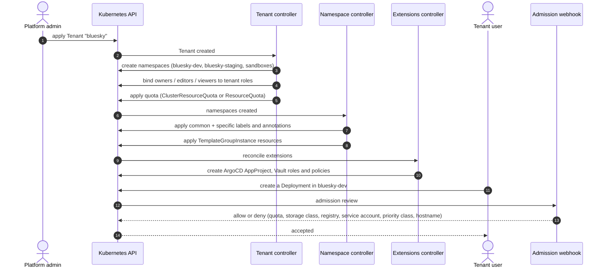
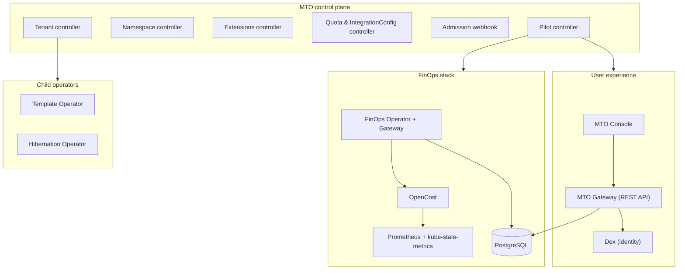

# How MTO Works

MTO is not a library you wire together. It is a platform you install once, after which a single Kubernetes resource — the **Tenant** — drives everything else.

This page walks the path from a Tenant definition to a running, governed, cost-attributed environment.

## The model

A platform administrator installs MTO and declares cluster-wide policy once in an **IntegrationConfig**: which roles map to tenant owners, editors and viewers, what metadata every managed namespace carries, and which external systems (ArgoCD, Vault) tenants extend into.

From then on, onboarding a team is one object:

```yaml
apiVersion: tenantoperator.stakater.com/v1beta3
kind: Tenant
metadata:
  name: bluesky
spec:
  quota: small
  accessControl:
    owners:
      users:
        - anna@aurora.org
    editors:
      groups:
        - bluesky-developers
  namespaces:
    withTenantPrefix:
      - dev
      - staging
    sandboxes:
      enabled: true
  storageClasses:
    allowed:
      - standard
```

MTO reconciles that into namespaces, role bindings, quota objects, network isolation and templated resources — and keeps reconciling. Drift is corrected, not merely detected. Delete the Tenant and, if you asked for it, the whole footprint goes with it.

## The reconciliation path



Two mechanisms do the work, and the distinction matters:

- **Controllers** create and continuously reconcile what the tenant owns — namespaces, RBAC, quota objects, metadata, templated resources, external identities.
- **The admission webhook** enforces the boundary at write time. A tenant user cannot exceed quota, pull from an unapproved registry, claim a storage class outside their allow-list, use a denied service account, escalate priority class, or claim a hostname belonging to someone else — the request is rejected before it lands.

Guardrails set by the administrator; self-service inside them for the tenant.

## The components

MTO installs its own supporting platform rather than assuming you already run one.



The **Pilot controller** provisions and manages that supporting stack — Console, Gateway, PostgreSQL, Prometheus, OpenCost, `kube-state-metrics`, Dex and the FinOps components — so cost visibility and the self-service UI work out of the box rather than after a separate integration project.

See [Architecture](../concepts/architecture.md) for the full component table.

## Where each capability comes from

| Capability | Delivered by | Enforced or observed how |
|---|---|---|
| Multi-Tenancy | Tenant, Namespace and Quota controllers | Namespaces, RBAC and quota reconciled continuously; webhook rejects out-of-bounds writes |
| Templates | Template Operator (Template, TemplateInstance, TemplateGroupInstance) | Resources rendered into tenant namespaces and kept in sync |
| FinOps | FinOps Operator and Gateway, OpenCost, Prometheus | Usage sampled per namespace, aggregated per tenant, priced and stored |
| Hibernation | Hibernation Operator (ClusterResourceSupervisor) | Deployments and StatefulSets scaled down on a schedule or on demand, and restored on wake |
| Extensions | Extensions controller | Tenant identity projected into ArgoCD, Vault and other platform services |
| Console | Pilot controller, Console, Gateway, Dex | Both personas see the same tenant model through a UI backed by the same API |

## Everything as code

The Tenant, Quota, IntegrationConfig, Template and ClusterResourceSupervisor resources are ordinary Kubernetes objects. They belong in Git, go through review, and are applied by whatever GitOps tool you already run. The Console reads and writes the same objects, so a change made in the UI is visible in the API and vice versa — there is no second source of truth.

## Next

- [Why MTO](why-mto.md) — the argument for adopting it
- [Key Capabilities](key-features.md) — what each capability includes
- [Architecture](../concepts/architecture.md) — components and controllers in detail
- [Tenant](../concepts/tenant.md) — the full Tenant model
- [Create a Tenant](../guides/create-tenant.md) — do it for real
