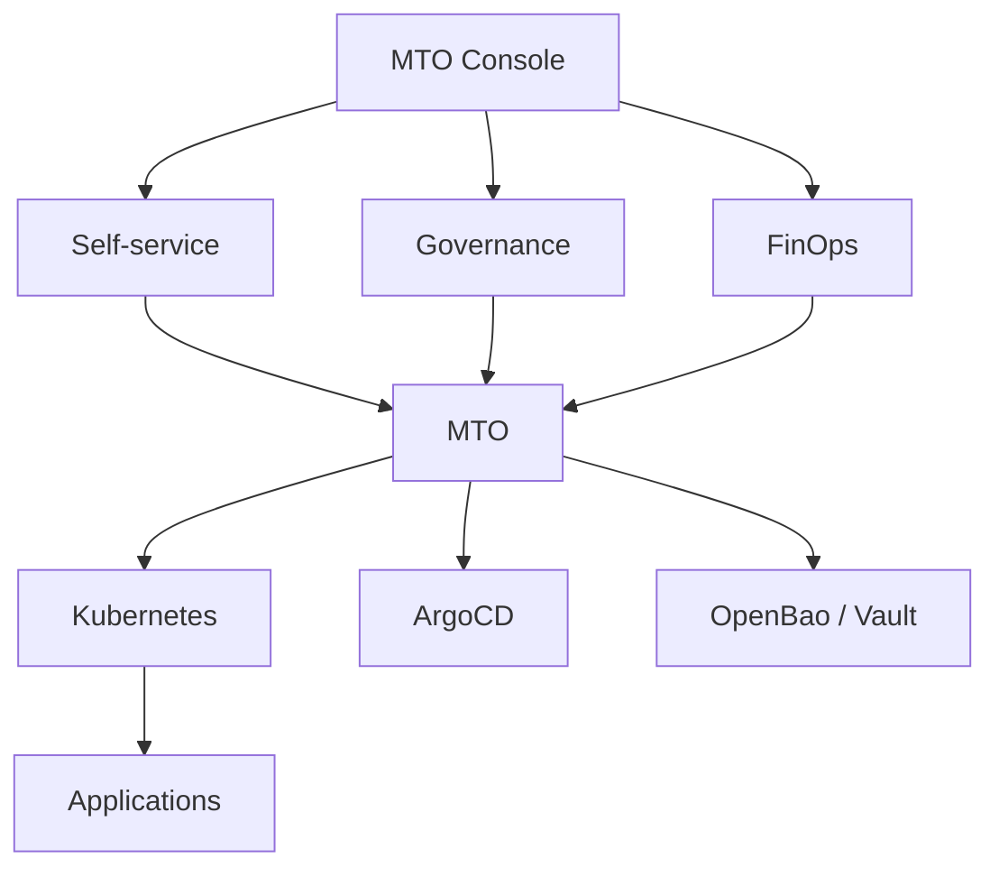

# Use Cases

MTO is for organizations running Kubernetes as a shared platform across several teams, departments, business units or customers. The situations below are the ones it was built for — most evaluators recognize themselves in more than one.

## Enterprise platform teams

**The situation.** A platform team runs Kubernetes or OpenShift for many internal application teams. As adoption grows, the team becomes the manual coordinator of namespaces, access, quota, network boundaries, standard configuration, integrations and cost questions. Platform engineers spend their time serving requests instead of improving the platform.

**What MTO does.** Each application team becomes a Tenant. Its members come from your existing identity provider groups, so joining or leaving the team changes cluster access automatically. The team owns a fixed set of namespaces — typically `dev`, `staging`, `prod` prefixed with the tenant name — and can create more within the quota it was given. Sandboxes give each developer a personal namespace inside the team's boundary, rather than a shared scratch namespace nobody dares clean up.

```yaml
apiVersion: tenantoperator.stakater.com/v1beta3
kind: Tenant
metadata:
  name: payments
spec:
  quota: medium
  accessControl:
    owners:
      groups:
        - payments-leads
    editors:
      groups:
        - payments-developers
  namespaces:
    withTenantPrefix:
      - dev
      - staging
      - prod
    sandboxes:
      enabled: true
```

The platform team moves from operating resources on behalf of teams to operating a platform teams can safely consume themselves.

## Service providers and multi-customer platforms

**The situation.** A vendor, managed service provider or internal cloud provider serves many customers or business units from shared infrastructure. Each needs its own users, namespaces, resource allocation, standard configuration and cost figure — and one customer must not be able to affect another.

Customers usually have no cluster access at all; Kubernetes is an implementation detail. What matters is that instances are isolated and that cost-to-serve is known.

**What MTO does.** Each customer is a Tenant, created by the same automation that handles commercial onboarding — a definition committed to Git and applied by your GitOps tool. Quota per customer prevents one instance from starving the rest and maps cleanly onto whatever plan they bought. Templates guarantee every customer environment is provisioned identically. Showback prices each customer's consumption, so cost-to-serve is a number you read rather than model. Offboarding is a deletion.

This raises infrastructure utilization without giving every customer a dedicated cluster where the isolation requirement does not justify one — see [Deployment Models](deployment-models.md).

## Development and test platforms

**The situation.** Non-production environments need to appear quickly, then become hard to govern and expensive to keep. They consume capacity overnight, at weekends, and long after a project went quiet.

**What MTO does.** Five capabilities combine here:

* **Self-service namespaces and sandboxes** — teams get environments without a provisioning ticket.
* **Templates** — every new environment arrives with the standard platform configuration already in it.
* **Quota** — teams operate inside a boundary the platform team set once.
* **[Hibernation](../guides/hibernate-tenant.md)** — idle workloads sleep on a schedule and wake on demand.
* **[Cost visibility](../console/showback.md)** — the platform team can see which environments are actually expensive.

The result is a controlled development platform rather than an uncontrolled collection of namespaces.

## Platform standardization

**The situation.** The platform team has standards for networking, security, observability, configuration and secrets. Enforcing them means documentation, reviews, admission policies, scripts and repeated manual configuration — and compliance is still only as good as the last person who read the wiki.

**What MTO does.** Templates package those standards as reusable platform capabilities and distribute them across tenant environments. They can be optional, for tenants to consume, or enforced — applied to every namespace of one tenant or of all tenants, and kept in sync. A documented baseline becomes a guaranteed one, and new namespaces are compliant by construction rather than by checklist.

## Cost accountability

**The situation.** Shared infrastructure makes simple organizational questions hard to answer: which team is consuming what, which environments are expensive, how much capacity is already committed, and where can we reclaim it?

**What MTO does.** Consumption is attributed to tenants and namespaces and exposed through [Cost Analysis](../console/showback.md) and [Capacity Planning](../console/capacity-planning.md). Because a namespace exists only because a tenant declared it, there is no unattributed remainder and no separate tagging convention to maintain. Hibernation then acts on what the numbers show. MTO covers both halves of the problem: understand consumption, then reduce it.

## Multi-tenant GitOps

**The situation.** The cluster isolates tenants properly while the GitOps platform stays shared. Unless ArgoCD's own configuration is governed just as carefully, a tenant can reach applications or resources that belong to someone else — and that configuration is maintained by hand, separately from the cluster's tenancy model.

**What MTO does.** MTO provisions an ArgoCD `AppProject` per tenant, scoped to the repositories the tenant may deploy from and the namespaces it may deploy into, with cluster-resource allow-lists and namespace-resource deny-lists. Delivery boundaries line up with platform boundaries because both come from the same Tenant definition. See [ArgoCD Multi-Tenancy](../integrations/argocd.md).

## Shared secrets management

**The situation.** A central secrets platform runs alongside Kubernetes, and its authorization model is a second administrative system with its own namespaces, policies and roles — drifting from the cluster's tenancy model every time a team changes.

**What MTO does.** The tenant boundary extends into [OpenBao](../integrations/openbao/readme.md) or [Vault](../integrations/vault/vault.md): each tenant gets its own secrets path with the policies and login roles that let its people and workloads reach it and nothing else, derived from the `Tenant` resource you already maintain. Application teams stop writing secrets-platform policy entirely.

## Building an internal developer platform

MTO does not try to be every platform service. It provides the common tenant layer underneath them — one consistent answer to *who the tenant is, what they own, what they may consume, and what boundaries apply* — across Kubernetes and the supported services around it.



## Where MTO fits best

MTO earns its place when:

* Several teams or customers share Kubernetes infrastructure.
* Namespace and RBAC management has become operationally complex.
* The platform team wants controlled self-service instead of a ticket queue.
* Environments need consistent standards that are actually enforced.
* Resource consumption needs organizational accountability.
* Non-production environments consume capacity nobody is using.
* Tenant boundaries need to extend into GitOps and secrets management.
* You are building an internal developer platform or a Kubernetes-based cloud platform.

## Where MTO is not the right answer

If a tenant is genuinely untrusted and needs its own API server — hostile workloads, or a hard regulatory boundary between tenants — namespace-based multi-tenancy is not the tool. MTO is built for teams, departments and customers inside one organization's trust boundary. [Deployment Models](deployment-models.md) covers what to reach for instead, and where MTO still fits alongside it.

## Next

* [Deployment Models](deployment-models.md) — shared, virtual and dedicated clusters
* [Key Capabilities](key-features.md) — what each capability area includes
* [How MTO Works](how-it-works.md) — the reconciliation path, end to end
* [Create a Tenant](../guides/create-tenant.md) — start with one object
