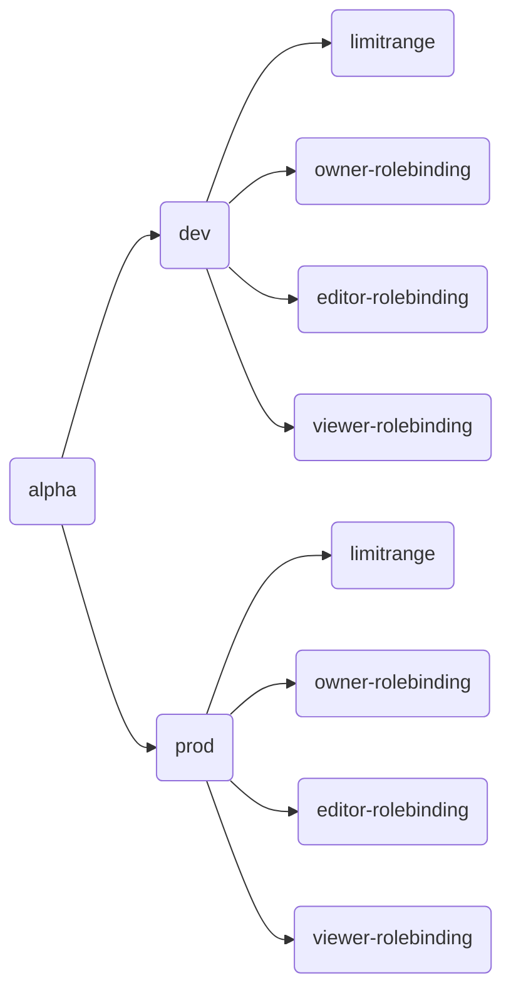
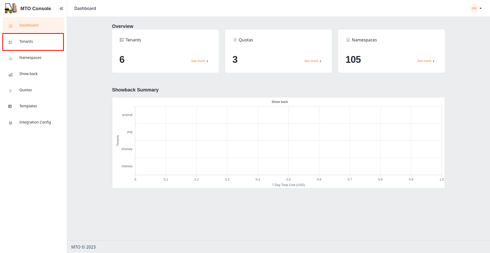
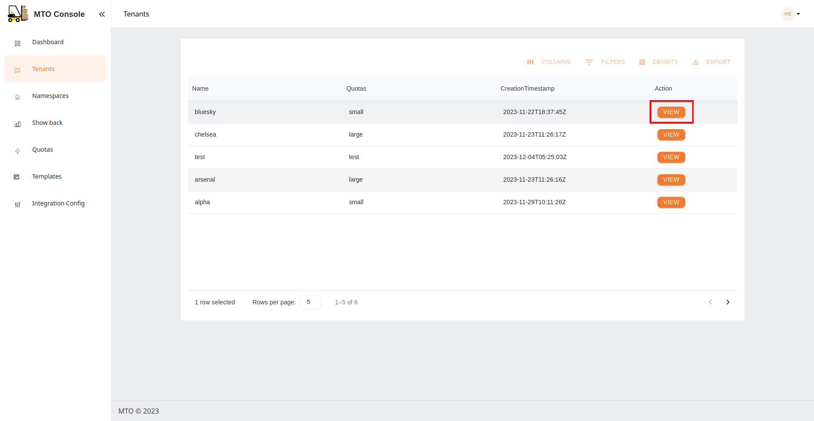

# Graph Visualization on MTO Console

Effortlessly associate tenants with their respective resources using the enhanced graph feature on the MTO Console. This dynamic graph illustrates the relationships between tenants and the resources they create, encompassing both MTO's proprietary resources and native Kubernetes/OpenShift elements.

Example Graph:

Explore with an intuitive graph that showcases the relationships between tenants and their resources. The MTO Console's graph feature simplifies the understanding of complex structures, providing you with a visual representation of your tenant's organization.

To view the graph of your tenant, follow the steps below:

- Navigate to `Tenants` page on the MTO Console using the left navigation bar.

- Click on `View` of the tenant for which you want to view the graph.

- Click on `Graph` tab on the tenant details page.

