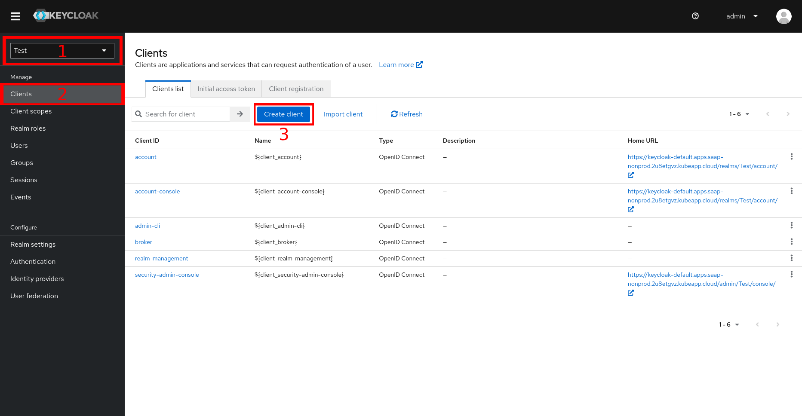
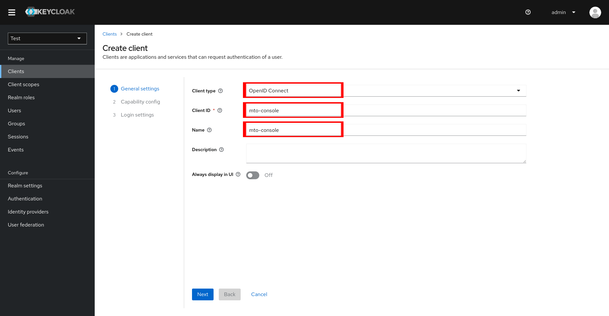
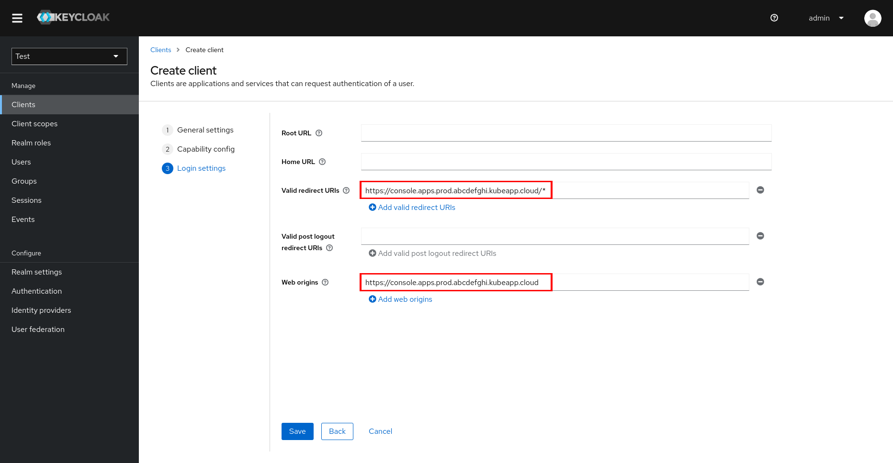

# Integrating External Keycloak

This guide will help you integrate an external Keycloak instance with the MTO Console.

## Prerequisites

- An OpenShift cluster with Multi Tenant Operator installed.
- An external Keycloak instance.

## Steps

**Navigate to the Keycloak console.**

- Go to your realm.
- Click on the `Clients`.
- Click on the `Create` button to create a new client.



**Create a new client.**

- Fill in the `Client ID`, `Client Name` and `Client Protocol` fields.



- Add `Valid Redirect URIs` and `Web Origins` for the client.



> **Note:** The `Valid Redirect URIs` and `Web Origins` should be the URL of the MTO Console.

- Click on the `Save` button.

## Update Integration Config

- Update the `IntegrationConfig` CR with the following configuration.

```yaml
integrations: 
  keycloak:
    realm: <realm>
    address: <keycloak-address>
    clientName: <client-name>
```

- Now, the MTO Console will be integrated with the external Keycloak instance.
