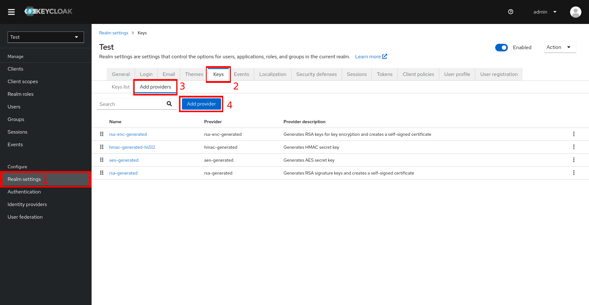
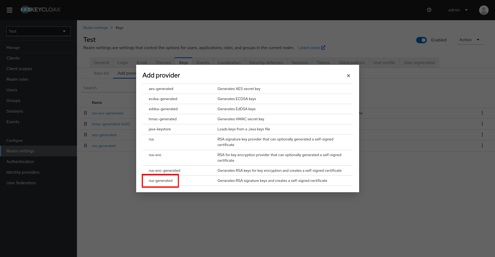
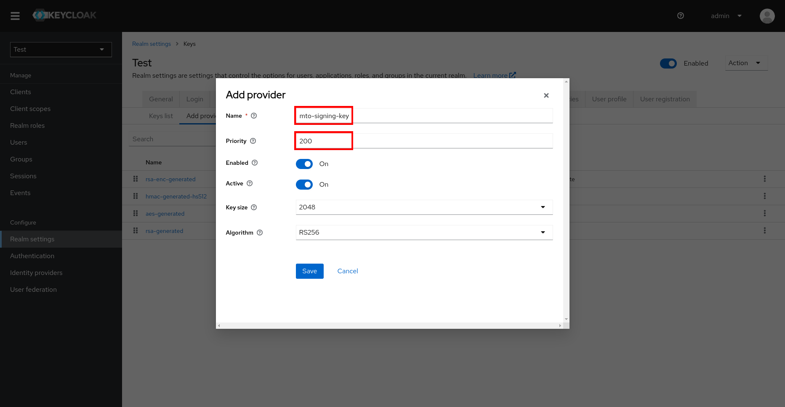
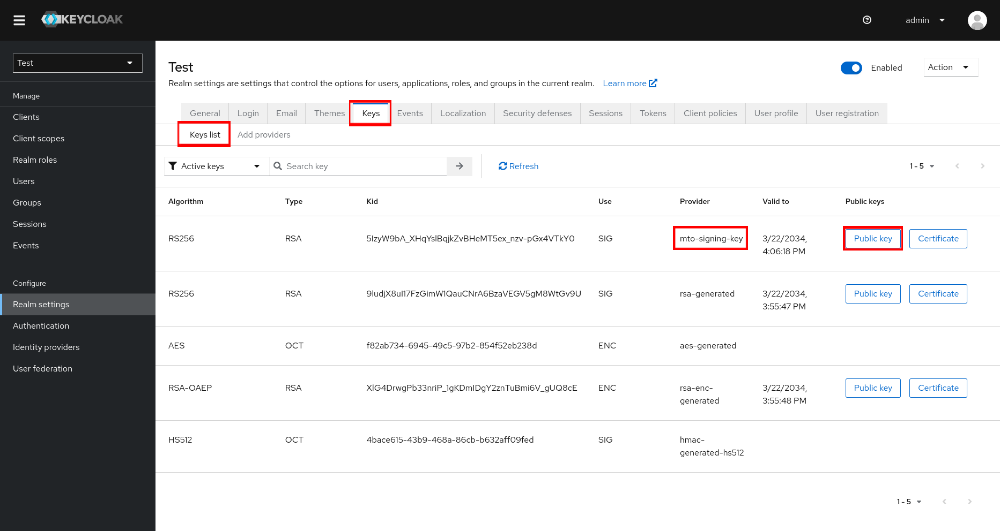

# Integrating External Keycloak

This guide will help you integrate an external Keycloak instance with the MTO Console.

## Prerequisites

- An OpenShift cluster with Multi Tenant Operator installed.
- An external Keycloak instance.

## Steps

**Navigate to the Keycloak console.**

- Go to your realm.
- Click on the `Clients`.
- Click on the `Create` button to create a new client.


**Create a new client.**

- Fill in the `Client ID`, `Client Name` and `Client Protocol` fields.


- Add `Valid Redirect URIs` and `Web Origins` for the client.


> **Note:** The `Valid Redirect URIs` and `Web Origins` should be the URL of the MTO Console.

- Click on the `Save` button.

**Get the client secret.**

- Navigate to `Realm Settings`.
- Select the `Keys` tab.
- Select the `Add Providers` sub-tab.
- Click on `Add Provider` button.



- Select `rsa-generated` from the list.



- Assign `Name` and `Priority` to the provider.



- Click on the `Save` button.

- Navigate to the `Keys` tab again.
- Select `Key List` sub-tab.
- Click on the `Public Key` button for the provider we just created.



- Copy the `Public Key` and create a secret in the OpenShift cluster.

```bash
kubectl create secret generic keycloak-public-key --from-literal=SIGNATURE_PUBLIC_KEY=<public-key> -n <namespace>
```

or create a secret from a file.

```yaml
apiVersion: v1
kind: Secret
metadata:
  name: keycloak-public-key
  namespace: <namespace>
type: Opaque
data:
  SIGNATURE_PUBLIC_KEY: <base64-encoded-public-key>
```

## Update Integration Config

- Update the `IntegrationConfig` CR with the following configuration.

```yaml
integrations: 
  keycloak:
    realm: <realm>
    address: <keycloak-address>
    clientName: <client-name>
    publicKeySecretRef:
      name: keycloak-public-key
      namespace: <namespace>
```

- Now, the MTO Console will be integrated with the external Keycloak instance.
