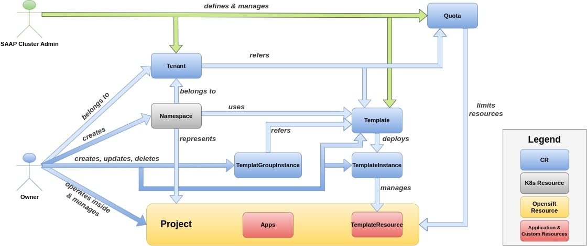
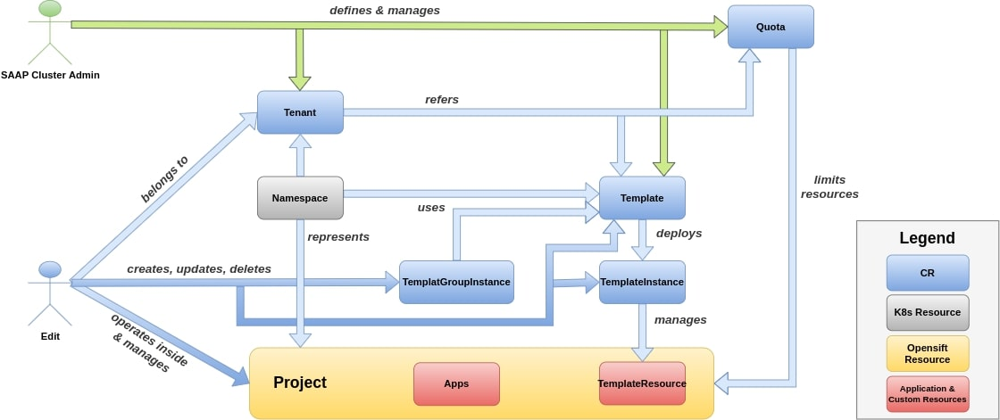
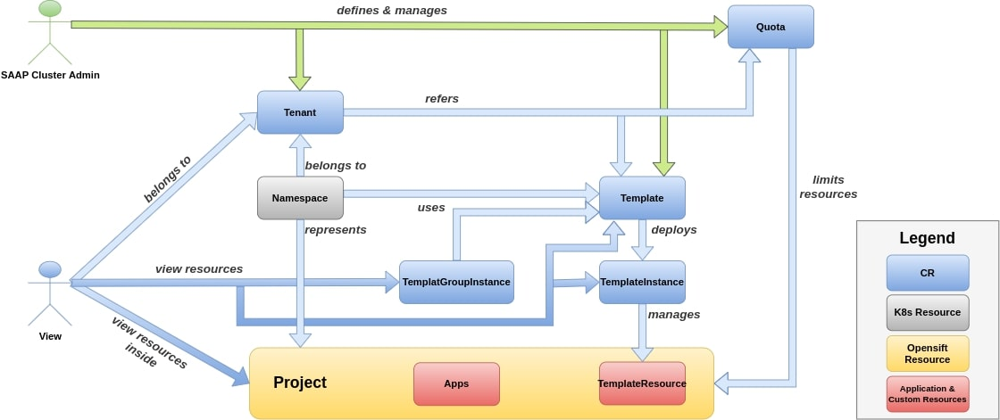

# Tenant Member Roles

> After adding support for custom roles within MTO, this page is only applicable if you use OpenShift and its default `owner`, `edit`, and `view` roles. For more details, see the [IntegrationConfig spec](./integration-config.md)

MTO tenant members can have one of following 3 roles:

1. Owner
1. Editor
1. Viewer

## 1. Owner

fig 2. Shows how tenant owners manage their tenant using MTO

Owner is an admin of a tenant with some restrictions. It has privilege to see all resources in their Tenant with some additional privileges. They can also create new `namespaces`.

*Owners will also inherit roles from `Edit` and `View`.*

### Access Permissions

* Role and RoleBinding access in `Project` :
    * delete
    * create
    * list
    * get
    * update
    * patch

### Quotas Permissions

* LimitRange and ResourceQuota access in `Project`
    * get
    * list
    * watch

* Daemonset access in `Project`
    * create
    * delete
    * get
    * list
    * patch
    * update
    * watch

### Resources Permissions

* CRUD access on Template, TemplateInstance and TemplateGroupInstance of MTO custom resources
* CRUD access on ImageStreamTags in `Project`
* Get access on CustomResourceDefinitions in `Project`
* Get, list, watch access on Builds, BuildConfigs in `Project`
* CRUD access on following resources in `Project`:
    * Prometheuses
    * Prometheusrules
    * ServiceMonitors
    * PodMonitors
    * ThanosRulers
* Permission to create Namespaces.
* Restricted to perform actions on cluster resource Quotas and Limits.

## 2. Editor

fig 3. Shows editors role in a tenant using MTO

Edit role will have edit access on their `Projects`, but they wont have access on `Roles` or `RoleBindings`.

*Editors will also inherit `View` role.*

### Access Permissions

* ServiceAccount access in `Project`
    * create
    * delete
    * deletecollection
    * get
    * list
    * patch
    * update
    * watch
    * impersonate

### Quotas Permissions

* AppliedClusterResourceQuotas and ResourceQuotaUsages access in `Project`
    * get
    * list
    * watch

### Builds ,Pods , PVC Permissions

* Pod, PodDisruptionBudgets and PVC access in `Project`
    * get
    * list
    * watch
    * create
    * delete
    * deletecollection
    * patch
    * update
* Build, BuildConfig, BuildLog, DeploymentConfig, Deployment, ConfigMap, ImageStream , ImageStreamImage and ImageStreamMapping access in `Project`
    * get
    * list
    * watch
    * create
    * delete
    * deletecollection
    * patch
    * update

### Resources Permissions

* CRUD access on Template, TemplateInstance and TemplateGroupInstance of MTO custom resources
* Job, CronJob, Task, Trigger and Pipeline access in `Project`
    * get
    * list
    * watch
    * create
    * delete
    * deletecollection
    * patch
    * update
* Get access on projects
* Route and NetworkPolicies access in `Project`
    * get
    * list
    * watch
    * create
    * delete
    * deletecollection
    * patch
    * update
* Template, ReplicaSet, StatefulSet and DaemonSet access in `Project`
    * get
    * list
    * watch
    * create
    * delete
    * deletecollection
    * patch
    * update
* CRUD access on all Projects related to
    * Elasticsearch
    * Logging
    * Kibana
    * Istio
    * Jaeger
    * Kiali
    * Tekton.dev
* Get access on CustomResourceDefinitions in `Project`
* Edit and view permission on `jenkins.build.openshift.io`
* InstallPlan access in `Project`
    * get
    * list
    * watch
    * delete
* Subscription and PackageManifest access in `Project`
    * get
    * list
    * watch
    * create
    * delete
    * deletecollection
    * patch
    * update

## 3. Viewer

fig 4. Shows viewers role in a tenant using MTO

Viewer role will only have view access on their `Project`.

### Access Permissions

* ServiceAccount access in `Project`
    * get
    * list
    * watch

### Quotas Permissions

* AppliedClusterResourceQuotas access in `Project`
    * get
    * list
    * watch

### Builds ,Pods , PVC Permissions

* Pod, PodDisruptionBudget and PVC access in `Project`
    * get
    * list
    * watch
* Build, BuildConfig, BuildLog, DeploymentConfig, ConfigMap, ImageStream, ImageStreamImage and ImageStreamMapping access in `Project`
    * get
    * list
    * watch

### Resources Permissions

* Get, list, view access on Template, TemplateInstance and TemplateGroupInstance of MTO custom resources
* Job, CronJob, Task, Trigger and Pipeline access in `Project`
    * get
    * list
    * watch
* Get access on projects
* Routes, NetworkPolicies and Daemonset access in `Project`
    * get
    * list
    * watch
* Template, ReplicaSet, StatefulSet and Daemonset in `Project`
    * get
    * list
    * watch
* Get,list,watch access on all projects related to
    * Elasticsearch
    * Logging
    * Kibana
    * Istio
    * Jaeger
    * Kiali
    * Tekton.dev
* Get, list, watch access on ImageStream, ImageStreamImage and ImageStreamMapping in `Project`
* Get access on CustomResourceDefinition in `Project`
* View permission on `Jenkins.Build.Openshift.io`
* Subscription, PackageManifest and InstallPlan access in `Project`
    * get
    * list
    * watch
