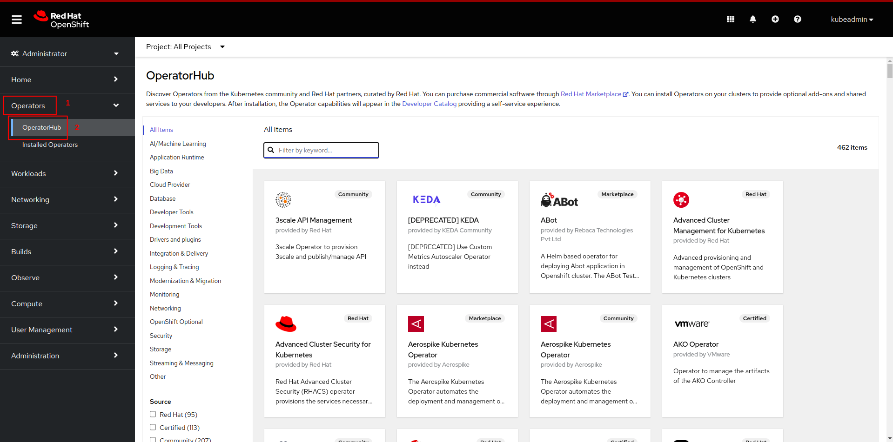
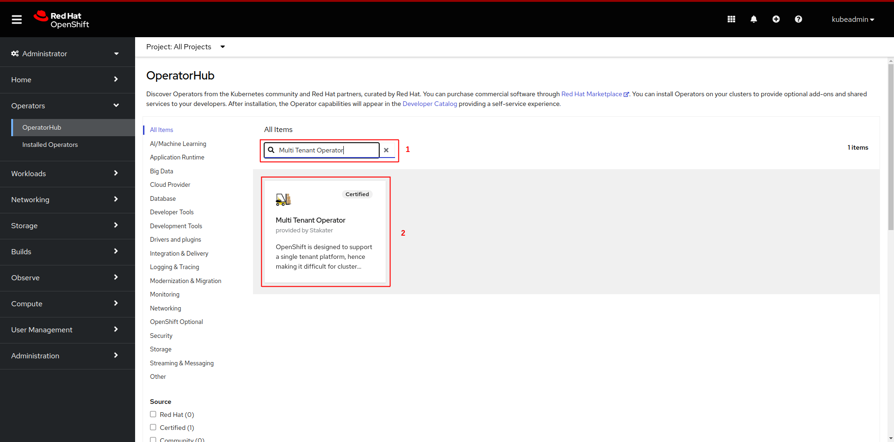
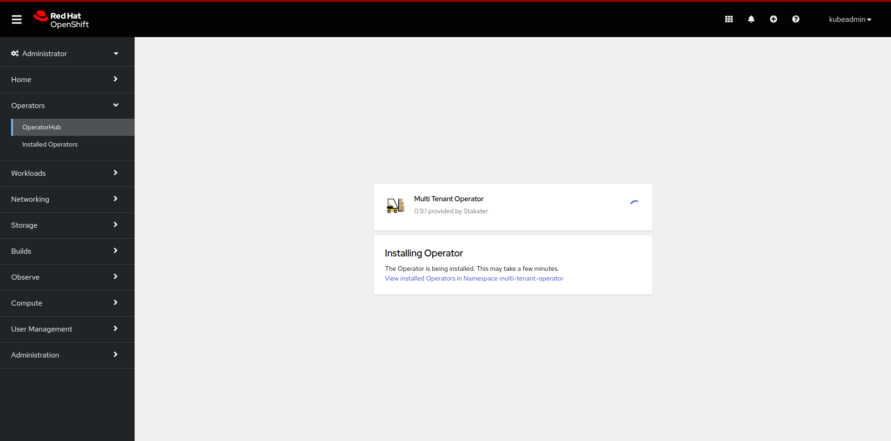
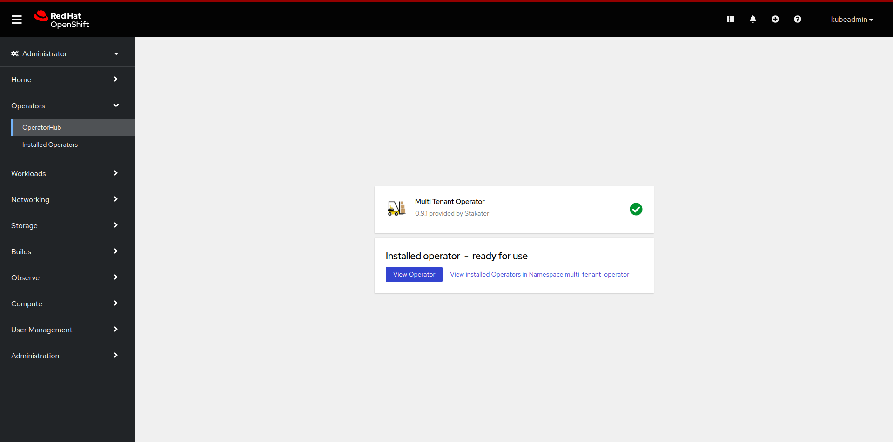
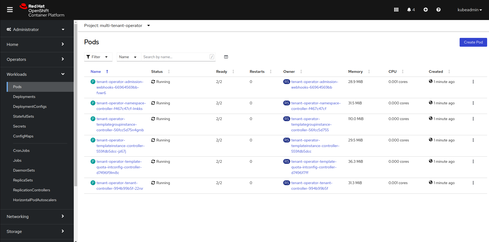

# Installation

This document contains instructions on installing, uninstalling and configuring Multi Tenant Operator using OpenShift MarketPlace.

1. [OpenShift OperatorHub UI](#installing-via-operatorhub-ui)

1. [CLI/GitOps](#installing-via-cli-or-gitops)

1. [Uninstall](#uninstall-via-operatorhub-ui)

## Requirements

* An **OpenShift** cluster [v4.7 - v4.12]

## Installing via OperatorHub UI

* After opening OpenShift console click on `Operators`, followed by `OperatorHub` from the side menu



* Now search for `Multi Tenant Operator` and then click on `Multi Tenant Operator` tile



* Click on the `install` button


* Select `Updated channel`. Select `multi-tenant-operator` to install the operator in `multi-tenant-operator` namespace from `Installed Namespace` dropdown menu. After configuring `Update approval` click on the `install` button.

> Note: Use `stable` channel for seamless upgrades. For `Production Environment` prefer `Manual` approval and use `Automatic` for `Development Environment`


* Wait for the operator to be installed



* Once successfully installed, MTO will be ready to enforce multi-tenancy in your cluster



> Note: MTO will be installed in `multi-tenant-operator` namespace.

### Configuring IntegrationConfig

IntegrationConfig is required to configure the settings of multi-tenancy for MTO.

* We recommend using the following IntegrationConfig as a starting point

```yaml
apiVersion: tenantoperator.stakater.com/v1alpha1
kind: IntegrationConfig
metadata:
  name: tenant-operator-config
  namespace: multi-tenant-operator
spec:
  openshift:
    privilegedNamespaces:
      - default
      - ^openshift-*
      - ^kube-*
      - ^redhat-*
    privilegedServiceAccounts:
      - ^system:serviceaccount:default-*
      - ^system:serviceaccount:openshift-*
      - ^system:serviceaccount:kube-*
      - ^system:serviceaccount:redhat-*
```

For more details and configurations check out [IntegrationConfig](../how-to-guides/integration-config.md).

## Installing via CLI OR GitOps

* Create namespace `multi-tenant-operator`

```bash
oc create namespace multi-tenant-operator
namespace/multi-tenant-operator created
```

* Create an OperatorGroup YAML for MTO and apply it in `multi-tenant-operator` namespace.

```bash
oc create -f - << EOF
apiVersion: operators.coreos.com/v1
kind: OperatorGroup
metadata:
  name: tenant-operator
  namespace: multi-tenant-operator
EOF
operatorgroup.operators.coreos.com/tenant-operator created
```

* Create a subscription YAML for MTO and apply it in `multi-tenant-operator` namespace. To enable console set `.spec.config.env[].ENABLE_CONSOLE` to `true`. This will create a route resource, which can be used to access the Multi-Tenant-Operator console.

```bash
oc create -f - << EOF
apiVersion: operators.coreos.com/v1alpha1
kind: Subscription
metadata:
  name: tenant-operator
  namespace: multi-tenant-operator
spec:
  channel: stable
  installPlanApproval: Automatic
  name: tenant-operator
  source: certified-operators
  sourceNamespace: openshift-marketplace
  startingCSV: tenant-operator.v0.9.1
  config:
    env:
      - name: ENABLE_CONSOLE
        value: 'true'
EOF
subscription.operators.coreos.com/tenant-operator created
```

> Note: To bring MTO via GitOps, add the above files in GitOps repository.

* After creating the `subscription` custom resource open OpenShift console and click on `Operators`, followed by `Installed Operators` from the side menu


* Wait for the installation to complete


* Once the installation is complete click on `Workloads`, followed by `Pods` from the side menu and select `multi-tenant-operator` project


* Once pods are up and running, MTO will be ready to enforce multi-tenancy in your cluster



### Configuring IntegrationConfig

IntegrationConfig is required to configure the settings of multi-tenancy for MTO.

* We recommend using the following IntegrationConfig as a starting point:

```yaml
apiVersion: tenantoperator.stakater.com/v1alpha1
kind: IntegrationConfig
metadata:
  name: tenant-operator-config
  namespace: multi-tenant-operator
spec:
  openshift:
    privilegedNamespaces:
      - default
      - ^openshift-*
      - ^kube-*
      - ^redhat-*
    privilegedServiceAccounts:
      - ^system:serviceaccount:default-*
      - ^system:serviceaccount:openshift-*
      - ^system:serviceaccount:kube-*
      - ^system:serviceaccount:redhat-*
```

For more details and configurations check out [IntegrationConfig](../how-to-guides/integration-config.md).

## Uninstall via OperatorHub UI

You can uninstall MTO by following these steps:

* Decide on whether you want to retain tenant namespaces and ArgoCD AppProjects or not. If yes, please set `spec.onDelete.cleanNamespaces` to `false` for all those tenants whose namespaces you want to retain, and `spec.onDelete.cleanAppProject` to `false` for all those tenants whose AppProject you want to retain. For more details check out [onDelete](./tenant/deleting-tenant.md#retaining-tenant-namespaces-and-appproject-when-a-tenant-is-being-deleted)

* After making the required changes open OpenShift console and click on `Operators`, followed by `Installed Operators` from the side menu


* Now click on uninstall and confirm uninstall.


* Now the operator has been uninstalled.

* `Optional:` you can also manually remove MTO's CRDs and its resources from the cluster.

## Notes

* For more details on how to use MTO please refer [Tenant tutorial](./tenant/create-tenant.md).
* For more details on how to extend your MTO manager ClusterRole please refer [extend-admin-clusterrole](../reference-guides/admin-clusterrole.md).
