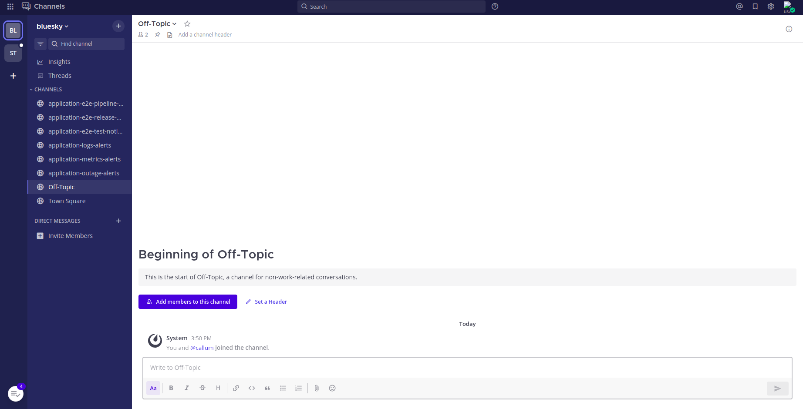

# Creating Mattermost Teams for your tenant

Bill wants each tenant to also have their own Mattermost Teams. To make sure this happens correctly, Bill will first add the `stakater.com/mattermost: true` label to the tenant:

```yaml
apiVersion: tenantoperator.stakater.com/v1beta2
kind: Tenant
metadata:
  name: sigma
  labels:
    stakater.com/mattermost: 'true'
spec:
  argocd:
    sourceRepos:
      # specify source repos here
      - "https://github.com/stakater/GitOps-config"
  owners:
    users:
      - user
  editors:
    users:
      - user1
  quota: medium
  sandbox: false
  namespaces:
    withTenantPrefix:
      - dev
      - build
      - prod
```

Now user can logIn to Mattermost to see their Team and relevant channels associated with it.



The name of the Team is similar to the Tenant name. Notification channels are pre-configured for every team, and can be modified.
