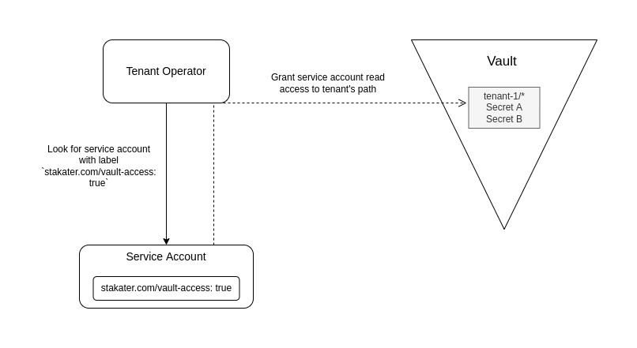

# Vault Multitenancy

HashiCorp Vault is an identity-based secret and encryption management system. Vault validates and authorizes a system's clients (users, machines, apps) before providing them access to secrets or stored sensitive data.

## Vault integration in Multi Tenant Operator

MTO manages tenant authentication via Vault. MTO automatically creates policies and roles that allow the tenant namespace service accounts to **read** secrets at tenant's path in Vault. The name of the role is the same as **namespace** name.

The pod is authenticated to Vault using the [Kubernetes auth method](https://www.Vaultproject.io/docs/auth/kubernetes). In Vault, roles are associated with Kubernetes service accounts, which permits the service account to read Secrets at a particular path in Vault.

Fig 1. Shows how MTO manages authentication with Vault
